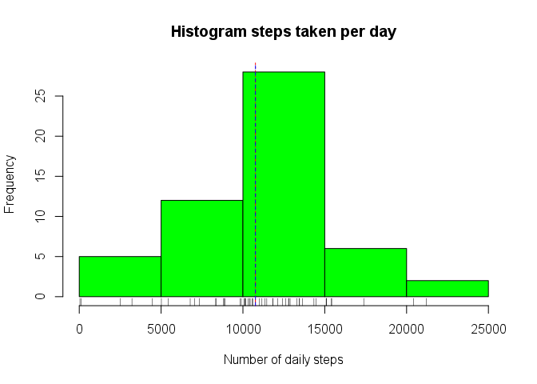
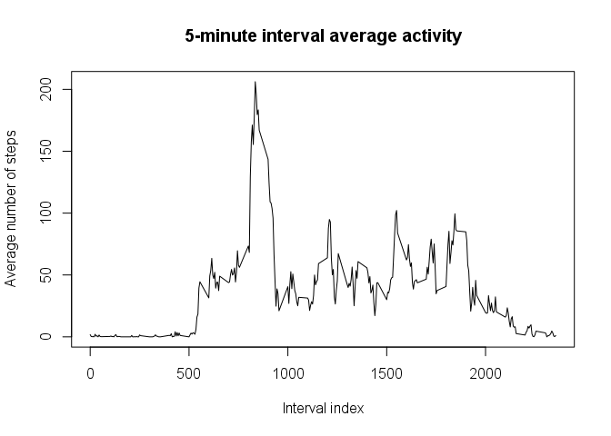
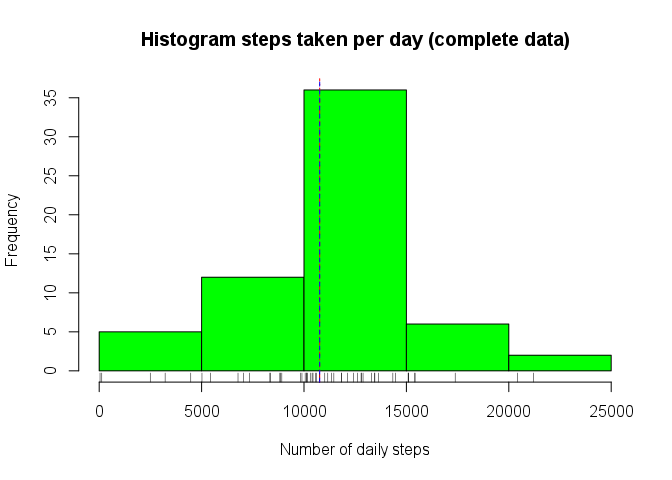
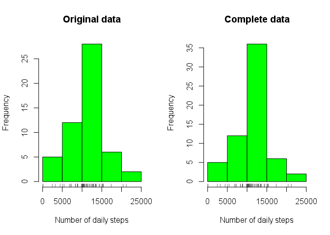

# Reproducible Research: Peer Assessment 1


## Loading and preprocessing the data

The first step is to load the data and run a preliminary processing it so it will be more easily handled in the latter part of this analysis.


```r
steps_data <- read.csv('activity.csv', header = TRUE)
```

The data consists of three variables: *steps* (integer), *date* (factor), *interva*l (int).

## What is mean total number of steps taken per day?

To determine the mean of steps taken each they, we will first try to determine the total nnumber of steps taken each day:


```r
daily_steps <- tapply(steps_data$steps, steps_data$date, sum)
summary(daily_steps)
```

```
##    Min. 1st Qu.  Median    Mean 3rd Qu.    Max.    NA's 
##      41    8841   10760   10770   13290   21190       8
```

In order to have a better understanding of what these data looks like we can plot these information in a histogram:


```r
hist(daily_steps, col = 'green', xlab = 'Number of daily steps', main = 'Histogram steps taken per day')
rug(daily_steps)
abline(v = median(daily_steps, na.rm = TRUE), lty = 4, col = 'red')
abline(v = mean(daily_steps, na.rm = TRUE), lty = 8, col = 'blue')
```

 

The histogram contains also the values of the *mean* and the *median* of the data. As these values are very close, the lines representing them seem to overlap.


```r
mean(daily_steps, na.rm = TRUE)
```

```
## [1] 10766.19
```

```r
median(daily_steps, na.rm = TRUE)
```

```
## [1] 10765
```


## What is the average daily activity pattern?

We are now going to make a time series plot (i.e. `type = "l"`) of the 5-minute interval (x-axis) and the average number of steps taken, averaged across all days (y-axis). This means that we are going to plot the mean of the steps taken in each of the available intervals.

To achieve this we will need to determine the intervals as a factor variable and the mean of the steps in each of these intervals:


```r
intervals <- levels(factor(steps_data$interval))
avg_steps <- tapply(steps_data$steps, steps_data$interval, mean, na.rm = TRUE)
plot(intervals, avg_steps, type = 'l', main = '5-minute interval average activity', xlab = 'Interval index', ylab = 'Average number of steps')
```

 

From these results it can be easily determined which 5-minute interval, on average across all the days in the dataset, contains the maximum number of steps:


```r
m <- max(avg_steps)
intv <- names(avg_steps[avg_steps == m])
```

Which results in a maximun value of **206.1698113** steps for the interval **835**.

## Imputing missing values

The data contains a number of days/intervals where there are missing values (coded as `NA`). The presence of missing days may introduce bias into some calculations or summaries of the data.

The first step in analyzing the missing values will be to calculate and report the total number of missing values in the dataset (i.e. the total number of rows with `NA`s):


```r
length(which(is.na(steps_data$steps) | is.na(steps_data$interval) | is.na(steps_data$date)))
```

```
## [1] 2304
```

In order to get a full data set we are going to devise a strategy for filling in all of the missing values in the dataset. What will be done is to substitute those missing values by the corresponding value of the average value previously calculated for that interval. So in the end we will have dataset that is equal to the original dataset but with the missing data filled in.


```r
# Show first rows of the data set
head(steps_data)
```

```
##   steps       date interval
## 1    NA 2012-10-01        0
## 2    NA 2012-10-01        5
## 3    NA 2012-10-01       10
## 4    NA 2012-10-01       15
## 5    NA 2012-10-01       20
## 6    NA 2012-10-01       25
```

```r
# Determine the rows with missing values
missing_values <- which(is.na(steps_data$steps) | is.na(steps_data$interval) | is.na(steps_data$date),)
# Substitute with the average values for the time interval in a new data set
complete_steps_data <- steps_data
for(i in missing_values){
    value <- as.numeric(avg_steps[as.character(steps_data[i, 3])])
    complete_steps_data[i, 1] <- value
}
# Show new top rows of the complete data set (no NAs)
head(complete_steps_data)
```

```
##       steps       date interval
## 1 1.7169811 2012-10-01        0
## 2 0.3396226 2012-10-01        5
## 3 0.1320755 2012-10-01       10
## 4 0.1509434 2012-10-01       15
## 5 0.0754717 2012-10-01       20
## 6 2.0943396 2012-10-01       25
```

We can compare this new data set with the original one. First, we are going to make a histogram of the total number of steps taken each day as well as calculate **mean** and **median** total number of steps taken per day.


```r
daily_steps_complete <- tapply(complete_steps_data$steps, complete_steps_data$date, sum)
summary(daily_steps_complete)
```

```
##    Min. 1st Qu.  Median    Mean 3rd Qu.    Max. 
##      41    9819   10770   10770   12810   21190
```

We can also plot these information in a histogram:


```r
hist(daily_steps_complete, col = 'green', xlab = 'Number of daily steps', main = 'Histogram steps taken per day (complete data)')
rug(daily_steps_complete)
abline(v = median(daily_steps_complete), lty = 4, col = 'red')
abline(v = mean(daily_steps_complete), lty = 8, col = 'blue')
```

 

The histogram contains also the values of the *mean* and the *median* of the data. As these values are the same, the lines representing them seem to overlap.


```r
mean(daily_steps_complete)
```

```
## [1] 10766.19
```

```r
median(daily_steps_complete)
```

```
## [1] 10766.19
```

We can draw the two plots together to better appreciate the difference:


```r
par(mfrow = c(1,2))
hist(daily_steps, col = 'green', xlab = 'Number of daily steps', main = 'Original data')
rug(daily_steps)
hist(daily_steps_complete, col = 'green', xlab = 'Number of daily steps', main = 'Complete data')
rug(daily_steps_complete)
```

 

As seen there is a small difference in the results. Even if there is an impact on the frequency in the interval between 10000 and 15000 steps, the mean has not changed and the median, has barely done so.

## Are there differences in activity patterns between weekdays and weekends?

We are now going to study if there is any difference in the activity patterns between weekdays and weekends.

The first step will be to create a new factor variable in the dataset with two levels -- "weekday" and "weekend" indicating whether a given date is a weekday or weekend day:


```r
library(lubridate)
Sys.setlocale('LC_TIME', 'C')
```

```
## [1] "C"
```

```r
complete_steps_data$weekday <- weekdays(as.Date(complete_steps_data$date))
regular <- c('Monday', 'Tuesday', 'Wednesday', 'Thursday', 'Friday')
weekend <- c('Saturday', 'Sunday')
total_data <- nrow(complete_steps_data)
for(i in 1:total_data){
    day <- complete_steps_data[i, 4]
    if(day %in% regular){
        complete_steps_data[i, 5] <- 'weekday'
    } else if(day %in% weekend){
        complete_steps_data[i, 5] <- 'weekend'
    }
}
names(complete_steps_data)[5] <- 'daytype'
head(complete_steps_data)
```

```
##       steps       date interval weekday daytype
## 1 1.7169811 2012-10-01        0  Monday weekday
## 2 0.3396226 2012-10-01        5  Monday weekday
## 3 0.1320755 2012-10-01       10  Monday weekday
## 4 0.1509434 2012-10-01       15  Monday weekday
## 5 0.0754717 2012-10-01       20  Monday weekday
## 6 2.0943396 2012-10-01       25  Monday weekday
```

```r
complete_steps_data$daytype <- factor(complete_steps_data$daytype)
```

With this new information we can study the difference in activity between weekday and weekends. We will make a panel plot containing a time series plot of the 5-minute interval (x-axis) and the average number of steps taken per interval, averaged across all weekday days or weekend days (y-axis).


```r
# Divide the data set in two depending on the day
day_division <- split(complete_steps_data, complete_steps_data$daytype)
weekday <- complete_steps_data[which(complete_steps_data$daytype == 'weekday'),]
mean_weekday <- tapply(weekday$steps, weekday$interval, mean)
weekend <- complete_steps_data[which(complete_steps_data$daytype == 'weekend'),]
mean_weekend <- tapply(weekend$steps, weekend$interval, mean)
# Plot each one
par(mar=c(4,4,1,1), cex.axis = 0.8)
layout(matrix(c(1,1,2,2), 2, 2, byrow = TRUE), widths=c(1,1), heights=c(2,2))
plot(intervals, mean_weekend, type = 'l', main = 'Weekend', ylab = 'Number of Steps', xlab = 'Interval')
plot(intervals, mean_weekday, type = 'l', main = 'Weekday', ylab = 'Number of Steps', xlab = 'Interval')
```

 

From these results, it seems that this subject is more active during the weekends.
